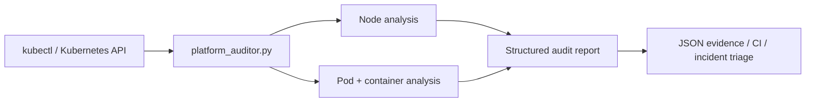

# Kubernetes Platform Auditor

A **Kubernetes operations and incident-triage utility** for detecting degraded nodes, unhealthy workloads, container readiness problems, restart storms, and common waiting-state failures from a cluster snapshot.

## Architecture



## What it checks

### Nodes
- `Ready` condition
- `MemoryPressure`
- `DiskPressure`
- `PIDPressure`
- `NetworkUnavailable`
- kubelet, OS, and kernel information

### Pods and containers
- pod phase
- container readiness
- total restart counts
- configurable high-restart threshold
- `CrashLoopBackOff`
- `ImagePullBackOff`
- `ErrImagePull`
- `CreateContainerConfigError`
- affected namespaces

A pod is **not considered healthy simply because its phase is `Running`**. Running pods with unready containers or critical waiting states are flagged.

## Operational flow

```text
Cluster snapshot
      |
      v
Node conditions -----------+
                            |
Pod/container status ------+--> health classification
                            |
Restart/waiting reasons ---+
                            |
                            v
                    structured JSON report
                            |
                  +---------+---------+
                  |                   |
                  v                   v
              CI checks        incident triage
```

## Live usage

Requirements:

- Python 3.9+
- `kubectl`
- working kubeconfig/context

```bash
python3 platform_auditor.py --pretty
```

Write the report:

```bash
python3 platform_auditor.py --output audit-report.json --pretty
```

Audit a specific context:

```bash
python3 platform_auditor.py --context research-cluster --pretty
```

Set a restart threshold:

```bash
python3 platform_auditor.py --restart-threshold 3 --pretty
```

## Reproducible demo without a cluster

Synthetic fixtures are included so the logic can be tested safely:

```bash
python3 platform_auditor.py \
  --fixture-dir fixtures \
  --output audit-report.json \
  --pretty
```

The fixture intentionally contains:

- one node with `DiskPressure`;
- one pod in `CrashLoopBackOff` with high restarts;
- one pod in `Pending` / `ImagePullBackOff`;
- one healthy running workload.

These are **synthetic operational examples**, not historical production evidence.

## Testing

```bash
python -m unittest discover -s tests -v
```

Tests verify:

- Running-but-unready workloads are caught;
- CrashLoopBackOff is extracted;
- restart thresholds are enforced;
- node pressure conditions are surfaced;
- degraded fixtures produce a warning report.

The portfolio CI runs these tests and executes the fixture-backed audit on every push/pull request.

## Example summary

```json
{
  "status": "warning",
  "summary": {
    "nodes": 2,
    "ready_nodes": 2,
    "nodes_with_pressure": 1,
    "pods": 3,
    "unhealthy_pods": 2,
    "crashloop_pods": 1,
    "high_restart_pods": 1,
    "pods_with_unready_containers": 2,
    "total_restarts": 8,
    "affected_namespaces": ["monitoring", "payments"]
  }
}
```

## Incident workflow

When the report flags a workload:

```bash
kubectl get pod -n <namespace> <pod> -o wide
kubectl describe pod -n <namespace> <pod>
kubectl logs -n <namespace> <pod> --all-containers --tail=200
kubectl get events -n <namespace> --sort-by=.lastTimestamp
```

For node pressure:

```bash
kubectl describe node <node>
kubectl top node <node>
kubectl get pods -A -o wide --field-selector spec.nodeName=<node>
```

See [RUNBOOK.md](RUNBOOK.md) for the full triage sequence.

## Repository structure

```text
kubernetes-platform-auditor/
├── platform_auditor.py
├── README.md
├── RUNBOOK.md
├── fixtures/
│   ├── nodes.json
│   └── pods.json
└── tests/
    └── test_platform_auditor.py
```

## Engineering concepts demonstrated

`Kubernetes` · `kubectl` · `Python` · `Platform Engineering` · `SRE` · `JSON` · `Operations` · `Incident Triage` · `DevOps` · `CI`

## Possible future extensions

- Prometheus metrics export
- Kubernetes Event correlation
- PVC/StorageClass checks
- resource requests/limits auditing
- NetworkPolicy coverage checks
- Slack/email integration
