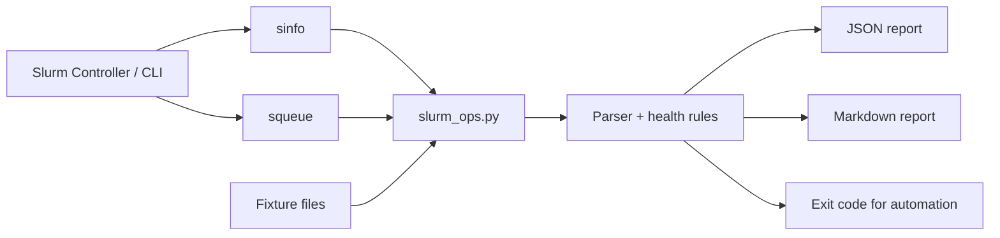

# Slurm Ops Automation

A lightweight **Slurm operations and incident-triage utility** for HPC administrators. It reads node/job state from `sinfo` and `squeue`, detects common warning conditions, and generates both JSON and Markdown reports.

The project is designed to work in two modes:

- **Live mode** against a real Slurm cluster.
- **Fixture mode** using committed sample `sinfo` / `squeue` outputs, so the project is fully demonstrable without access to the original cluster.

## Architecture



## Operational flow

```text
Collect Slurm state
      ↓
Parse nodes + jobs
      ↓
Normalize states
      ↓
Detect node warnings
      ↓
Detect job warnings
      ↓
Build summary
      ↓
JSON + Markdown reports
      ↓
Exit 0 = healthy / Exit 1 = warning
```

## What it detects

### Node conditions

The current rules flag states such as:

- `DOWN`
- `DRAIN` / `DRAINED`
- `FAIL` / `FAILING`
- `UNKNOWN`

### Job conditions

The current rules highlight:

- `PENDING`
- `FAILED`
- `CANCELLED`
- `TIMEOUT`
- `NODE_FAIL`
- `OUT_OF_MEMORY`

For pending/failed jobs, the report preserves the Slurm reason or node list so an operator has a starting point for triage.

## Demo without a cluster

```bash
cd showcase/slurm-ops-automation
python3 slurm_ops.py \
  --fixture-dir fixtures \
  --json-out demo-report.json \
  --markdown-out demo-report.md \
  --pretty
```

The committed fixture intentionally contains:

- one idle node;
- one mixed node;
- one drained node;
- one running job;
- one pending job waiting for resources;
- one failed job.

Because the fixture represents warnings, the command exits with status `1` after writing the reports. This behavior is intentional and useful for automation.

## Live cluster usage

Run from a host where `sinfo` and `squeue` are available:

```bash
python3 slurm_ops.py --pretty
```

The tool executes:

```text
sinfo -N -h -o %N|%T|%c|%m|%G
squeue -h -o %i|%P|%j|%u|%T|%M|%D|%R
```

and writes:

```text
slurm-report.json
slurm-report.md
```

## Example summary

```text
Status: WARNING
Nodes total: 3
Nodes ready/busy: 2
Node alerts: 1
Jobs total: 3
Running jobs: 1
Pending jobs: 1
Job alerts: 2
```

> The example above is generated from the committed **demo fixture**, not claimed as a historical production-cluster snapshot.

## Why JSON + Markdown

JSON is suitable for:

- CI/CD
- scheduled automation
- log collection
- downstream alerting
- machine processing

Markdown is suitable for:

- incident reports
- maintenance handoff
- ticket attachments
- human-readable cluster snapshots

## Tests

```bash
python3 -m unittest discover -s tests -v
```

Tests cover:

- node parsing;
- job parsing;
- warning detection;
- healthy-cluster behavior.

## Suggested production extensions

- `sacct` history and failed-job root-cause summaries
- partition utilization
- GPU allocation/health summaries
- node drain reasons from `scontrol show node`
- fair-share/accounting checks
- Prometheus exporter mode
- email/Slack/webhook alert integration
- configurable policy thresholds

## Skills demonstrated

`Linux` · `Slurm` · `HPC Operations` · `Python` · `Automation` · `Incident Triage` · `Observability` · `JSON` · `Testing`
